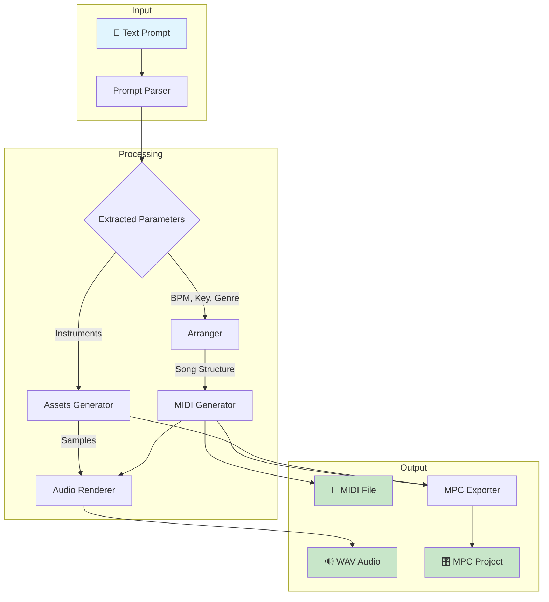
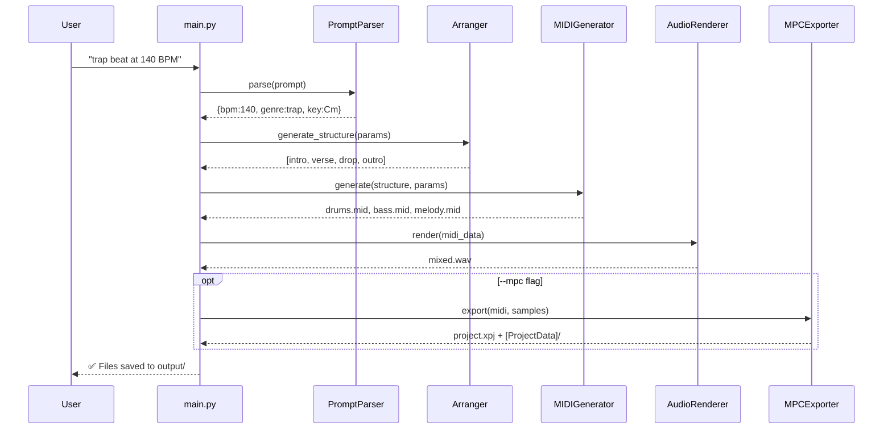
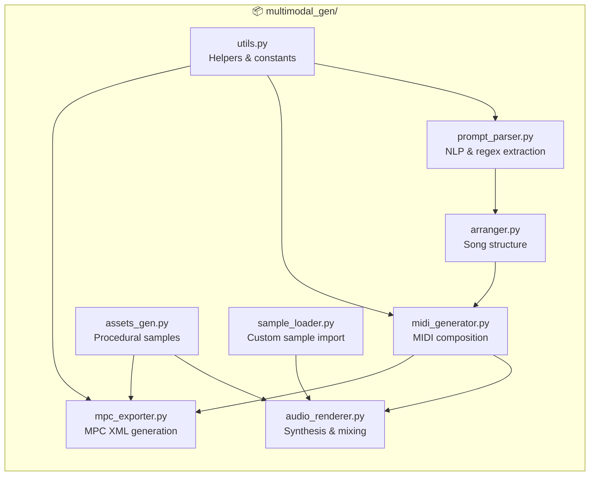
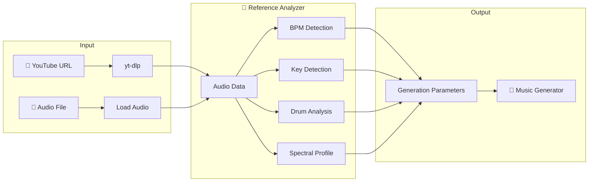

# 🎵 Multimodal AI Music Generator

> **Transform natural language into production-ready music projects with MIDI, audio, and MPC export**

[](https://www.python.org/downloads/)
[](LICENSE)
[](https://www.akaipro.com/)

---

## 📖 Table of Contents

- [Overview](#-overview)
- [Features](#-features)
- [Quick Start](#-quick-start)
- [Architecture](#-architecture)
- [Usage Guide](#-usage-guide)
- [Command Reference](#-command-reference)
- [Prompt Writing Guide](#-prompt-writing-guide)
- [Output Files Explained](#-output-files-explained)
- [Using Your Own Samples](#-using-your-own-samples)
- [MPC Integration](#-mpc-integration)
- [Audio Quality & Mixing](#-audio-quality--mixing)
- [Ethiopian Instruments](#-ethiopian-instruments)
- [Troubleshooting](#-troubleshooting)
- [Development](#-development)

---

## 🎯 Overview

**Multimodal AI Music Generator** is a Python-based music production system that converts text descriptions into complete music projects. Simply describe the beat you want, and the system generates:

| Output | Description |
|--------|-------------|
| 🎹 **MIDI File** | Standard .mid with humanized timing, velocity, and swing |
| 🔊 **WAV Audio** | Mixed master at 44.1kHz/16-bit with soft clipping protection |
| 🎛️ **MPC Project** | Full .xpj project with programs and samples for Akai MPC Software |

### Example

```bash
python main.py "dark trap soul beat at 87 BPM in C minor with 808 and piano" --mpc
```

This single command creates:
- `trap_87.0bpm_Cminor_*.mid` - Humanized MIDI file
- `trap_87.0bpm_Cminor_*.wav` - Rendered audio mix
- `trap_87.0bpm_Cminor_*_mpc/` - Complete MPC project folder

---

## ✨ Features

| Feature | Description | Status |
|---------|-------------|--------|
| 🗣️ **Natural Language Input** | Describe beats in plain English | ✅ Complete |
| 🎼 **Smart Parsing** | Auto-detect BPM, key, genre, instruments | ✅ Complete |
| 🎵 **Reference Analysis** | Analyze YouTube/audio to copy style | ✅ Complete |
| 🥁 **Humanized MIDI** | Velocity variation, swing, drummer physics | ✅ Complete |
| 🔊 **Audio Rendering** | Built-in synthesis + FluidSynth support | ✅ Complete |
| 📁 **MPC Export** | .xpj projects for MPC Software 2.13+ | ✅ Complete |
| 🎨 **Sample Import** | Use your own .wav samples or .xpm programs | ✅ Complete |
| 🎚️ **Soft Clipping** | Prevents digital distortion in loud mixes | ✅ Complete |
| 🪕 **Ethiopian Instruments** | Krar, Masenqo, Begena, Kebero synthesis | ✅ Complete |
| 🎛️ **Instrument Shaper** | Pro-Q3 style spectrum editor for sounds | ✅ Complete |
| 💻 **CPU-Only** | No GPU required | ✅ Complete |
| 🌐 **Offline** | No internet after install | ✅ Complete |

---

## 🚀 Quick Start

### Step 1: Install Python Dependencies

```bash
cd MUSE
pip install -r requirements.txt

# Optional: For reference analysis (YouTube/audio analysis)
pip install librosa yt-dlp
```

### Step 2: (Optional) Install FluidSynth for Better Audio

FluidSynth provides higher-quality audio rendering with SoundFont support:

**Windows (with Chocolatey):**
```bash
choco install fluidsynth
```

**macOS (with Homebrew):**
```bash
brew install fluidsynth
```

**Linux (Ubuntu/Debian):**
```bash
sudo apt install fluidsynth
```

> 💡 **Note:** FluidSynth is optional. The generator works without it using built-in synthesis.

### Step 2.1: (Recommended) Add a SoundFont (.sf2 or .sf3)

For best results with FluidSynth, place your own licensed SoundFont file in:

- `./assets/soundfonts/`

The renderer auto-detects common `.sf2` and `.sf3` filenames there (see `assets/soundfonts/README.md`).

Alternatively, pass an explicit path:

```bash
python main.py "smooth g-funk beat at 92 BPM" --soundfont "./assets/soundfonts/my_soundfont.sf3"
```

MUSE does not require or guarantee a committed SoundFont in the repo. Keep your preferred SoundFont locally or point to it explicitly with `--soundfont`.

On Windows, FluidSynth discovery checks these locations in order:

1. `MUSE_FLUIDSYNTH_EXE`
2. `PATH`
3. workspace-local portable installs such as `../tools/fluidsynth*/bin/fluidsynth.exe`
4. repo-local portable installs under `tools/**/bin/fluidsynth.exe`

Verify the audio toolchain at any time:

```bash
python main.py --diagnose-audio
```

The JSON diagnostics report includes `fluidsynth.available`, `fluidsynth.executable`, `fluidsynth.version`, and `soundfont.discovered`.

If you want the run to fail instead of falling back to procedural audio:

```bash
python main.py "smooth g-funk beat at 92 BPM" --require-soundfont
```

### Step 3: Generate Your First Beat

```bash
# Simple generation
python main.py "chill lofi hip hop beat with jazzy piano at 75 BPM"

# With MPC export
python main.py "hard trap beat with 808s at 140 BPM in D minor" --mpc

# With custom BPM and key
python main.py "ambient pad soundscape" --bpm 65 --key "A minor"
```

### Step 4: Find Your Output

Check the `output/` folder for your generated files!

---

## 🎹 Using an MPC (MIDI Controller Recording)

If you have an Akai MPC Studio (or any MIDI controller) connected, you can record your own drums/keys/lead and let the generator build the rest around it.

### 1) Install live MIDI backend

On Windows/macOS, `mido` typically needs `python-rtmidi` to see hardware ports:

```bash
pip install python-rtmidi
```

### 2) List MIDI inputs

```bash
python main.py --list-midi
```

### 3) Record a part and generate

Record drums from your MPC pads (replaces the generated drum lane):

```bash
python main.py "hard trap beat at 140 BPM in D minor, zaytoven church pianist" \
    --bpm 140 \
    --record-part drums \
    --midi-in "MPC" \
    --record-bars 8 \
    --count-in 1 \
    --quantize 1/16
```

Record keys (replaces the generated chord lane):

```bash
python main.py "trap soul at 87 BPM in C minor" \
    --bpm 87 \
    --record-part keys \
    --midi-in "MPC" \
    --record-bars 8
```

Record a lead (replaces the generated melody lane):

```bash
python main.py "trap beat at 140 BPM in D minor" \
    --bpm 140 \
    --record-part lead \
    --midi-in "MPC" \
    --record-bars 8
```

Notes:
- Use `--midi-in` as an exact name or a substring match.
- The app re-renders the WAV after swapping in your recorded MIDI so the audio matches what you played.

---

## 🏗️ Architecture

### System Overview


```mermaid
flowchart TB
    subgraph Input
        A[📝 Text Prompt] --> B[Prompt Parser]
    end
    
    subgraph Processing
        B --> C{Extracted Parameters}
        C --> |BPM, Key, Genre| D[Arranger]
        C --> |Instruments| E[Assets Generator]
        D --> |Song Structure| F[MIDI Generator]
        E --> |Samples| G[Audio Renderer]
    end
    
    subgraph Output
        F --> H[🎹 MIDI File]
        F --> G
        G --> I[🔊 WAV Audio]
        F --> J[MPC Exporter]
        E --> J
        J --> K[🎛️ MPC Project]
    end
    
    style A fill:#e1f5fe
    style H fill:#c8e6c9
    style I fill:#c8e6c9
    style K fill:#c8e6c9
```

### Generation Pipeline


```mermaid
sequenceDiagram
    participant User
    participant CLI as main.py
    participant Parser as PromptParser
    participant Arr as Arranger
    participant MIDI as MIDIGenerator
    participant Audio as AudioRenderer
    participant MPC as MPCExporter
    
    User->>CLI: "trap beat at 140 BPM"
    CLI->>Parser: parse(prompt)
    Parser-->>CLI: {bpm:140, genre:trap, key:Cm}
    
    CLI->>Arr: generate_structure(params)
    Arr-->>CLI: [intro, verse, drop, outro]
    
    CLI->>MIDI: generate(structure, params)
    MIDI-->>CLI: drums.mid, bass.mid, melody.mid
    
    CLI->>Audio: render(midi_data)
    Audio-->>CLI: mixed.wav
    
    opt --mpc flag
        CLI->>MPC: export(midi, samples)
        MPC-->>CLI: project.xpj + [ProjectData]/
    end
    
    CLI-->>User: ✅ Files saved to output/
```

### Module Responsibilities


```mermaid
flowchart LR
    subgraph Core["📦 multimodal_gen/"]
        PP[prompt_parser.py<br/>NLP & regex extraction]
        AR[arranger.py<br/>Song structure]
        MG[midi_generator.py<br/>MIDI composition]
        AU[audio_renderer.py<br/>Synthesis & mixing]
        ME[mpc_exporter.py<br/>MPC XML generation]
        AG[assets_gen.py<br/>Procedural samples]
        SL[sample_loader.py<br/>Custom sample import]
        UT[utils.py<br/>Helpers & constants]
    end
    
    PP --> AR
    AR --> MG
    MG --> AU
    MG --> ME
    AG --> AU
    AG --> ME
    SL --> AU
    UT --> PP
    UT --> MG
    UT --> ME
```

---

## 📚 Usage Guide

### Basic Generation

The simplest way to generate a beat:

```bash
python main.py "your description here"
```

The system automatically detects:
- **BPM** from words like "87 BPM", "slow", "fast"
- **Key** from "C minor", "F# major", "Dm"
- **Genre** from style words like "trap", "lofi", "house"
- **Instruments** from "808", "piano", "rhodes", "strings"

### Step-by-Step: Creating a Trap Beat

```bash
# Step 1: Generate with MPC export
python main.py "dark trap soul at 87 BPM in C minor with 808 and piano" --mpc -v

# Step 2: Check verbose output for progress
# [INFO] Parsing prompt...
# [INFO] Detected: BPM=87.0, Key=C minor, Genre=trap
# [INFO] Generating song structure...
# [INFO] Creating MIDI tracks...
# [INFO] Rendering audio...
# [INFO] Exporting MPC project...
# [INFO] ✅ Complete! Files saved to output/

# Step 3: Open in MPC Software
# Navigate to output/trap_87.0bpm_Cminor_*_mpc/
# Double-click the .xpj file
```

### Step-by-Step: Creating a Lofi Beat

```bash
# Lofi typically has swing and rhodes
python main.py "chill lofi hip hop with dusty rhodes and vinyl crackle at 75 BPM" --mpc

# The generator will:
# 1. Set BPM to 75
# 2. Apply lofi-style swing timing
# 3. Generate mellow chord progressions
# 4. Add vintage-style processing
```

### Using Custom Samples

Import your own samples for more personalized sounds:

```bash
# From a folder of .wav files
python main.py "boom bap beat at 90 BPM" --samples "C:\my-samples\drums"

# From an MPC .xpm program file
python main.py "trap beat" --samples "C:\my-programs\808kit.xpm"
```

### Generating Stems

Export separate tracks for mixing in your DAW:

```bash
python main.py "full production at 128 BPM" --stems

# Creates:
# - <project_name>_stems/
#   - <track_name>.wav  (one file per rendered track)
#   - stems_manifest.json
```

---

## 📋 Command Reference

For the authoritative, current CLI surface, run:

```bash
python main.py --help
```

Common forms:

```
python main.py "prompt" [options]
python main.py --server [options]
```

### Core generation

| Option | Short | Description |
|--------|-------|-------------|
| `--output DIR` | `-o` | Output directory (default: `./output`) |
| `--reference PATH_OR_URL` | `-r` | Analyze a YouTube URL or local audio file for style reference |
| `--score-plan PATH` | | Load a score-plan JSON file |
| `--bpm BPM` | | Override BPM from the prompt or reference |
| `--key KEY` | | Override key (for example `Am`, `C`, `F#m`) |
| `--duration-bars N` | | Override target generation length in bars |
| `--seed INT` | | Make generation reproducible |
| `--refine METADATA_PATH` | | Refine a previous run from `project_metadata.json` |
| `--json` | | Emit final machine-readable JSON on stdout |
| `--verbose` | `-v` | Show detailed progress |
| `--no-banner` | | Suppress banner output |

### Audio, SoundFont, and instruments

| Option | Short | Description |
|--------|-------|-------------|
| `--soundfont PATH` | | Use a specific `.sf2` or `.sf3` SoundFont for FluidSynth rendering |
| `--require-soundfont` | | Fail instead of falling back when FluidSynth/SoundFont rendering is unavailable |
| `--require-audio` | | Fail if no audio artifact is produced |
| `--diagnose-audio` | | Print FluidSynth/SoundFont/instrument diagnostics and exit |
| `--samples PATH` | | Import custom samples or MPC `.xpm` programs |
| `--instruments PATH` | `-i` | Add one or more instruments directories for intelligent sample selection |
| `--skip-default-instruments` | | Do not auto-load `./instruments` when `--instruments` is omitted |
| `--skip-expansions` | | Do not scan `../expansions` for this run |

### Presets, export, and iteration

| Option | Description |
|--------|-------------|
| `--preset NAME` | Apply a base preset |
| `--style-preset NAME` | Layer a style preset on top of `--preset` |
| `--production-preset NAME` | Layer a production preset on top |
| `--list-presets` | List available preset names and exit |
| `--mpc` | Export an MPC `.xpj` project |
| `--stems` | Render per-track stems into a `*_stems/` folder |
| `--template PATH` | Use a custom MPC template |
| `--takes N` | Generate alternative takes per track |
| `--comp` | Build a comp track from generated takes (`--takes >= 2`) |
| `--comp-bars N` | Bars per comp segment |
| `--no-bwf` | Disable Broadcast Wave metadata |
| `--use-agents` | Experimental Ethiopian-instrument agent workflow |

### Live MIDI, history, and server mode

| Option | Description |
|--------|-------------|
| `--list-midi` | List available MIDI input devices and exit |
| `--midi-in NAME` | MIDI input device name/substr for recording |
| `--record-part {drums,keys,lead}` | Replace a generated part with live MIDI |
| `--record-bars N` | Bars to record |
| `--record-seconds SECS` | Record by seconds (overrides `--record-bars`) |
| `--count-in N` | Count-in bars before recording |
| `--quantize {off,1/16,1/8}` | Quantize recorded notes |
| `--history` | Show generation history from `project_metadata.json` |
| `--compare VER_A VER_B` | Compare two saved versions from history |
| `--server` | Start OSC server mode for JUCE integration |
| `--port PORT` | OSC server port (responses go to `port+1`) |
| `--no-signals` | Disable signal handlers (useful in some terminals) |

### Examples

```bash
# Override BPM/key/output and cap the arrangement length
python main.py "beat" --bpm 95 --key Am --duration-bars 16 --output "./my-beats" -v

# Reproducible generation
python main.py "trap beat" --seed 12345 --duration-bars 16

# Audio diagnostics
python main.py --diagnose-audio

# Strict FluidSynth render with explicit SoundFont
python main.py "dark cinematic orchestral cue" --duration-bars 16 --soundfont "./assets/soundfonts/my_soundfont.sf3" --require-soundfont --require-audio

# Full production with stems and MPC
python main.py "full track at 130 BPM" --mpc --stems -v

# Reference-based generation (requires librosa + yt-dlp)
python main.py "make something like this" --reference "https://youtu.be/9fj01FSdkE0"
python main.py "trap beat" -r "./my_sample.wav" --mpc
```

---

## 🎵 Reference-Based Generation

Generate beats inspired by existing tracks! Provide a YouTube URL or audio file, and the system will analyze it to extract:

- **BPM** - Tempo detection
- **Key & Mode** - Harmonic analysis (C minor, F# major, etc.)
- **Genre** - Style classification (trap, lofi, house, etc.)
- **Groove** - Swing amount and feel
- **Spectral Profile** - 808 presence, brightness, lo-fi character

### Installation

Reference analysis requires additional packages:

```bash
pip install librosa yt-dlp
```

### Usage

```bash
# Analyze a YouTube video and generate a similar beat
python main.py "make a beat like this" --reference "https://youtu.be/9fj01FSdkE0" --mpc

# Use a local audio file as reference
python main.py "trap beat" --reference "./samples/my_beat.wav"

# Override detected values
python main.py "beat" -r "https://youtu.be/..." --bpm 90 --key Am
```

### How It Works


```mermaid
flowchart LR
    subgraph Input
        URL[🔗 YouTube URL] --> DL[yt-dlp]
        File[📁 Audio File] --> Load[Load Audio]
    end
    
    subgraph Analysis["🔬 Reference Analyzer"]
        DL --> Audio[Audio Data]
        Load --> Audio
        Audio --> BPM[BPM Detection]
        Audio --> Key[Key Detection]
        Audio --> Drums[Drum Analysis]
        Audio --> Spectral[Spectral Profile]
    end
    
    subgraph Output
        BPM --> Params[Generation Parameters]
        Key --> Params
        Drums --> Params
        Spectral --> Params
        Params --> Gen[🎵 Music Generator]
    end
```

### Analysis Features

| Feature | Description |
|---------|-------------|
| **BPM Detection** | Multi-method tempo analysis with half/double time handling |
| **Key Detection** | Chroma-based key and mode estimation |
| **808 Detection** | Sub-bass frequency analysis |
| **Trap Hi-Hats** | Rapid hi-hat pattern detection |
| **Four-on-Floor** | House/techno kick pattern detection |
| **Swing Analysis** | Groove feel quantification |
| **Lo-fi Character** | Vintage/warm tone detection |

---

## ✍️ Prompt Writing Guide

### Effective Prompt Structure

```
[mood/vibe] [genre] [beat/track] [with instruments] [at BPM] [in key]
```

### Examples by Genre

| Genre | Example Prompt |
|-------|---------------|
| **Trap** | "dark trap beat with hard 808s and hi-hat rolls at 145 BPM in D minor" |
| **Trap Soul** | "emotional trap soul with piano and soft 808 at 87 BPM in C minor" |
| **Lofi Hip Hop** | "chill lofi beat with dusty rhodes and vinyl crackle at 75 BPM" |
| **Boom Bap** | "classic boom bap with punchy drums and jazz samples at 92 BPM" |
| **House** | "deep house groove with four-on-floor kick at 124 BPM in F major" |
| **Ambient** | "atmospheric ambient pad soundscape at 65 BPM in A minor" |

### Keywords That Work

**Mood/Vibe:**
- dark, chill, emotional, hard, aggressive, mellow, dreamy, atmospheric

**Instruments:**
- 808, piano, rhodes, strings, synth, pad, bells, pluck, brass

**Drum Elements:**
- hi-hat rolls, snare, kick, clap, rimshot, percussion, shaker

**Effects/Style:**
- vinyl, dusty, sidechained, reverb, delay, filtered

---

## 📁 Output Files Explained

### Standard Output

```
output/
├── trap_87.0bpm_Cminor_20241209_123456.mid        # MIDI arrangement
├── trap_87.0bpm_Cminor_20241209_123456.wav        # Mixed audio when render succeeds
├── trap_87.0bpm_Cminor_20241209_123456_render_report.json  # Render diagnostics + analysis metadata
├── session_manifest.json                          # Structured session graph
├── project_metadata.json                          # Generation metadata + history
├── samples/                                       # Generated/resolved samples when used
│   ├── kick.wav
│   ├── snare.wav
│   └── ...
└── trap_87.0bpm_Cminor_20241209_123456_render_error.txt   # Written only when rendering fails
```

Key artifacts:
- `*_render_report.json` captures renderer diagnostics such as `renderer_path`, `render_status`, FluidSynth details, and related analysis metadata.
- `session_manifest.json` stores the structured session graph (sections, tracks, roles, and file references).
- `project_metadata.json` stores generation history, reproducibility data, preset context, and exported artifact paths.
- `*_render_error.txt` is only written when audio rendering fails or strict audio requirements abort the run.

### With --mpc Flag

Standard artifacts remain in the output directory, plus:

```
output/
├── trap_87.0bpm_Cminor_20241209_123456.mid
├── trap_87.0bpm_Cminor_20241209_123456.wav
└── trap_87.0bpm_Cminor_20241209_123456_mpc/    # MPC project folder
    ├── trap_87.0bpm_Cminor_20241209_123456.xpj # Main project file
    └── [ProjectData]/                           # MPC data folder
        ├── drums.xpm                            # Drum program
        ├── kick.wav                             # Drum samples
        ├── snare.wav
        ├── hihat.wav
        └── ...
```

### With --stems Flag

`--stems` adds a sibling `*_stems/` directory containing one rendered WAV per track plus a manifest:

```
output/
└── trap_87.0bpm_Cminor_20241209_123456_stems/
    ├── <track_name>.wav      # One WAV per rendered track (names vary by session)
    ├── <track_name>.wav
    ├── ...
    └── stems_manifest.json   # Stem metadata: role, peak, RMS, sample rate, bit depth
```

---

## 🎨 Using Your Own Samples

### From a Folder of WAV Files

Organize your samples in a folder:

```
my-samples/
├── kick.wav
├── snare.wav
├── hihat.wav
├── clap.wav
└── 808.wav
```

Then use:

```bash
python main.py "beat" --samples "path/to/my-samples"
```

The loader automatically detects:
- **kick** from filenames containing "kick", "bd", "bass drum"
- **snare** from "snare", "sd", "snr"
- **hi-hat** from "hat", "hh", "hihat"
- **clap** from "clap", "cp"
- **808** from "808", "sub"

### From MPC .xpm Program Files

If you have existing MPC programs:

```bash
python main.py "beat" --samples "path/to/my-kit.xpm"
```

The loader extracts all samples referenced in the .xpm file.

### Programmatic API

```python
from multimodal_gen import SampleLibrary, quick_load_samples

# Quick load from folder
samples = quick_load_samples("path/to/samples")

# Or use the full API
library = SampleLibrary()
library.load_from_folder("path/to/drums")
library.load_from_xpm("path/to/kit.xpm")

# Get a specific sample
kick = library.get_sample("kick")
```

---

## 🎛️ MPC Integration

### Opening Projects in MPC Software

1. **Navigate** to your output folder
2. **Open** the `*_mpc` folder
3. **Double-click** the `.xpj` file
4. MPC Software will load the project with all tracks and samples

### Project Structure

The generator creates MPC 2.13+ compatible projects:

```
project_mpc/
├── project.xpj              # XML project file (480 PPQ)
└── [ProjectData]/           # Required folder name format
    ├── drums.xpm            # Drum program with pad mappings
    ├── kick.wav             # 44.1kHz/16-bit samples
    ├── snare.wav
    └── ...
```

### Key Compatibility Notes

| Requirement | Implementation |
|-------------|----------------|
| PPQ (Pulses Per Quarter) | 480 ticks (MPC standard) |
| Sample Rate | 44100 Hz |
| Bit Depth | 16-bit |
| Path Style | Relative (`.\[ProjectData]\...`) |
| XML Encoding | UTF-8 |

### Editing in MPC Software

After loading:
- **Tracks** appear in the track view
- **Programs** are loaded and assigned
- **Samples** are in the [ProjectData] folder
- **Sequences** contain the MIDI notes

You can:
- Edit note timing/velocity
- Swap samples in programs
- Add effects
- Export stems
- Render to audio

---

## 🔊 Audio Quality & Mixing

### Mix Levels

The generator uses professional mix levels:

| Element | Level | Pan |
|---------|-------|-----|
| Kick/808 | -6 dB | Center |
| Snare | -6 dB | Center |
| Hi-hats | -9 dB | Slight L/R |
| Bass | -9 dB | Center |
| Melodic | -12 dB | Stereo spread |
| Pads | -15 dB | Wide stereo |

### Soft Clipping

The audio renderer includes **soft clipping** to prevent harsh digital distortion:

```
Before: Hard clipping causes harsh artifacts at 0 dB
After:  Soft clipping (tanh saturation) provides gentle limiting
```

This ensures loud mixes sound full rather than distorted.

### Humanization

Based on professional drum programming techniques:

1. **Velocity Variation**: ±10-15% random variation
2. **Timing Swing**: 50-60% for shuffled feel
3. **Drummer Physics**: Weaker hand simulation
4. **Ghost Notes**: Subtle snare hits between main beats

---

## 🪕 Ethiopian Instruments

The generator includes physically-modeled Ethiopian traditional instruments with authentic synthesis algorithms:

### Instruments

| Instrument | Type | Description | Algorithm |
|------------|------|-------------|-----------|
| **Krar** | Plucked lyre | 6-string bowl lyre with bright, clear tone | Karplus-Strong |
| **Masenqo** | Bowed fiddle | Single-string spike fiddle with expressive "crying" voice | Stick-slip bow model |
| **Begena** | Bass lyre | 10-string meditation lyre with characteristic buzz | Karplus-Strong + buzz |
| **Kebero** | Drum | Traditional double-headed hand drum | Modal synthesis |

### Ethiopian Scales

The generator supports traditional Ethiopian modes:

| Scale | Notes (in C) | Character |
|-------|--------------|-----------|
| **Tizita Minor** | C Db E F G Ab Bb | Nostalgic, sad (Ethiopian blues) |
| **Tizita Major** | C D E F G A Bb | Longing, bittersweet |
| **Ambassel** | C Db E F G Ab B | Spiritual, meditative |
| **Anchihoye** | C D Eb F G A Bb | Joyful, celebratory |

### Instrument Shaper Tool

A FabFilter Pro-Q3 style spectrum editor for shaping Ethiopian instrument sounds:

```bash
python instrument_shaper.py
```

**Features:**
- Single interactive spectrum graph
- Drag harmonic nodes to shape instrument timbre
- Real-time preview with [Space]
- Switch instruments with [1] [2] [3] keys
- Add harmonics with double-click
- Remove with right-click
- Scroll to adjust Q/resonance

### Demo Song Generation

Generate an authentic Ethiopian Tizita ballad:

```python
# See output/ethiopian_tizita_authentic.wav for example
# Key instruments: Masenqo (lead), Krar (rhythm), Begena (bass)
```

---

## 🔧 Troubleshooting

### "No audio output"

**Cause:** Audio rendering failed, or strict `--require-soundfont` / `--require-audio` blocked fallback.
**Solution:**
```bash
python main.py --diagnose-audio
```

Check these fields in the JSON output:
- `fluidsynth.available`
- `fluidsynth.executable`
- `fluidsynth.version`
- `soundfont.discovered`

Then inspect `*_render_report.json` and, on failure, `*_render_error.txt` in your output directory. If needed, point directly to a portable FluidSynth binary with `MUSE_FLUIDSYNTH_EXE` and/or pass a local `.sf2` or `.sf3` file with `--soundfont`.

Without strict flags, MUSE can fall back to procedural synthesis when FluidSynth or a SoundFont is unavailable.

### "MPC won't load project"

**Cause:** Path or format issues  
**Solutions:**
- Ensure `[ProjectData]` folder is sibling to `.xpj`
- Check sample rates are 44100Hz
- Verify no absolute paths in .xpj (should be relative)

### "Audio sounds distorted"

**Cause:** Clipping from loud mix  
**Solution:** The soft clipping should handle this, but you can also:
```bash
# Regenerate with new seed for different mix
python main.py "beat" --seed 99999
```

### "MIDI timing sounds robotic"

**Cause:** Insufficient humanization  
**Solution:** The humanization is automatic; try regenerating:
```bash
python main.py "lofi beat with heavy swing"
```

### "Can't find output files"

**Solution:** Check the `output/` folder in the project directory:
```bash
dir output/
# or
ls output/
```

---

## 👨‍💻 Development

### Project Structure

```
MUSE/
├── main.py                      # CLI entry point and orchestration
├── multimodal_gen/
│   ├── __init__.py              # Package exports
│   ├── prompt_parser.py         # NLP & regex extraction
│   ├── arranger.py              # Song structure generation
│   ├── midi_generator.py        # MIDI composition + humanization
│   ├── audio_renderer.py        # Rendering, diagnostics, stems, mixdown
│   ├── session_graph.py         # Structured session manifest builder
│   ├── fluidsynth_runtime.py    # FluidSynth executable discovery + probe helpers
│   ├── fluidsynth_profiles.py   # Genre-scoped FluidSynth post-render policies
│   ├── preset_system.py         # Genre/style/production preset registry
│   ├── instrument_patch.py      # Shared instrument-patch contract / reporting
│   ├── mpc_exporter.py          # .xpj/.xpm XML generation
│   ├── assets_gen.py            # Procedural sample generation
│   ├── sample_loader.py         # Custom sample import
│   ├── server/                  # OSC / JSON-RPC / worker integration
│   └── utils.py                 # Helpers, constants, MIDI utils
├── assets/
│   ├── templates/               # MPC templates
│   ├── samples/                 # Bundled samples
│   └── soundfonts/              # User-provided .sf2/.sf3 SoundFonts when present
├── instruments/                 # Local instrument/sample libraries (optional)
├── scripts/                     # Smoke tests and environment proof helpers
├── output/                      # Generated projects
├── tests/                       # Test suite
├── requirements.txt             # Python dependencies
└── README.md                    # This file
```

### Running Tests

```bash
# Run all tests
pytest tests/ -v

# With coverage
pytest tests/ --cov=multimodal_gen --cov-report=html

# Specific test
pytest tests/test_prompt_parser.py -v
```

### Adding New Features

1. **New Genre**: Update `prompt_parser.py` keyword detection
2. **New Instrument**: Add to `assets_gen.py` synthesis
3. **New Export Format**: Create new exporter module
4. **New CLI Flag**: Update `main.py` argparse

---

## 📄 License

MIT License - See [LICENSE](LICENSE) file

---

## 🙏 Acknowledgments

- **Sound On Sound** - Drum programming research and humanization techniques
- **FluidSynth Team** - Open source synthesizer
- **Akai Professional** - MPC documentation and format specifications
- **The Lo-fi Hip Hop Community** - Endless inspiration

---

<div align="center">

**Made with 🎵 by the Multimodal AI Music Generator Team**

[Report Bug](../../issues) · [Request Feature](../../issues) · [Documentation](../../wiki)

</div>
