# 🎵 Multimodal AI Music Generator

> **Transform natural language into production-ready music projects with MIDI, audio, and MPC export**

[](https://www.python.org/downloads/)
[](LICENSE)
[](https://www.akaipro.com/)

---

## 📖 Table of Contents

- [Overview](#-overview)
- [Features](#-features)
- [Quick Start](#-quick-start)
- [Architecture](#-architecture)
- [Usage Guide](#-usage-guide)
- [Command Reference](#-command-reference)
- [Prompt Writing Guide](#-prompt-writing-guide)
- [Output Files Explained](#-output-files-explained)
- [Using Your Own Samples](#-using-your-own-samples)
- [MPC Integration](#-mpc-integration)
- [Audio Quality & Mixing](#-audio-quality--mixing)
- [Ethiopian Instruments](#-ethiopian-instruments)
- [Troubleshooting](#-troubleshooting)
- [Development](#-development)

---

## 🎯 Overview

**Multimodal AI Music Generator** is a Python-based music production system that converts text descriptions into complete music projects. Simply describe the beat you want, and the system generates:

| Output | Description |
|--------|-------------|
| 🎹 **MIDI File** | Standard .mid with humanized timing, velocity, and swing |
| 🔊 **WAV Audio** | Mixed master at 44.1kHz/16-bit with soft clipping protection |
| 🎛️ **MPC Project** | Full .xpj project with programs and samples for Akai MPC Software |

### Example

```bash
python main.py "dark trap soul beat at 87 BPM in C minor with 808 and piano" --mpc
```

This single command creates:
- `trap_87.0bpm_Cminor_*.mid` - Humanized MIDI file
- `trap_87.0bpm_Cminor_*.wav` - Rendered audio mix
- `trap_87.0bpm_Cminor_*_mpc/` - Complete MPC project folder

---

## ✨ Features

| Feature | Description | Status |
|---------|-------------|--------|
| 🗣️ **Natural Language Input** | Describe beats in plain English | ✅ Complete |
| 🎼 **Smart Parsing** | Auto-detect BPM, key, genre, instruments | ✅ Complete |
| 🎵 **Reference Analysis** | Analyze YouTube/audio to copy style | ✅ Complete |
| 🥁 **Humanized MIDI** | Velocity variation, swing, drummer physics | ✅ Complete |
| 🔊 **Audio Rendering** | Built-in synthesis + FluidSynth support | ✅ Complete |
| 📁 **MPC Export** | .xpj projects for MPC Software 2.13+ | ✅ Complete |
| 🎨 **Sample Import** | Use your own .wav samples or .xpm programs | ✅ Complete |
| 🎚️ **Soft Clipping** | Prevents digital distortion in loud mixes | ✅ Complete |
| 🪕 **Ethiopian Instruments** | Krar, Masenqo, Begena, Kebero synthesis | ✅ Complete |
| 🎛️ **Instrument Shaper** | Pro-Q3 style spectrum editor for sounds | ✅ Complete |
| 💻 **CPU-Only** | No GPU required | ✅ Complete |
| 🌐 **Offline** | No internet after install | ✅ Complete |

---

## 🚀 Quick Start

### Step 1: Install Python Dependencies

```bash
cd multimodal-ai-music-gen
pip install -r requirements.txt

# Optional: For reference analysis (YouTube/audio analysis)
pip install librosa yt-dlp
```

### Step 2: (Optional) Install FluidSynth for Better Audio

FluidSynth provides higher-quality audio rendering with SoundFont support:

**Windows (with Chocolatey):**
```bash
choco install fluidsynth
```

**macOS (with Homebrew):**
```bash
brew install fluidsynth
```

**Linux (Ubuntu/Debian):**
```bash
sudo apt install fluidsynth
```

> 💡 **Note:** FluidSynth is optional. The generator works without it using built-in synthesis.

### Step 3: Generate Your First Beat

```bash
# Simple generation
python main.py "chill lofi hip hop beat with jazzy piano at 75 BPM"

# With MPC export
python main.py "hard trap beat with 808s at 140 BPM in D minor" --mpc

# With custom BPM and key
python main.py "ambient pad soundscape" --bpm 65 --key "A minor"
```

### Step 4: Find Your Output

Check the `output/` folder for your generated files!

---

## 🏗️ Architecture

### System Overview

```mermaid
flowchart TB
    subgraph Input
        A[📝 Text Prompt] --> B[Prompt Parser]
    end
    
    subgraph Processing
        B --> C{Extracted Parameters}
        C --> |BPM, Key, Genre| D[Arranger]
        C --> |Instruments| E[Assets Generator]
        D --> |Song Structure| F[MIDI Generator]
        E --> |Samples| G[Audio Renderer]
    end
    
    subgraph Output
        F --> H[🎹 MIDI File]
        F --> G
        G --> I[🔊 WAV Audio]
        F --> J[MPC Exporter]
        E --> J
        J --> K[🎛️ MPC Project]
    end
    
    style A fill:#e1f5fe
    style H fill:#c8e6c9
    style I fill:#c8e6c9
    style K fill:#c8e6c9
```



### Generation Pipeline

```mermaid
sequenceDiagram
    participant User
    participant CLI as main.py
    participant Parser as PromptParser
    participant Arr as Arranger
    participant MIDI as MIDIGenerator
    participant Audio as AudioRenderer
    participant MPC as MPCExporter
    
    User->>CLI: "trap beat at 140 BPM"
    CLI->>Parser: parse(prompt)
    Parser-->>CLI: {bpm:140, genre:trap, key:Cm}
    
    CLI->>Arr: generate_structure(params)
    Arr-->>CLI: [intro, verse, drop, outro]
    
    CLI->>MIDI: generate(structure, params)
    MIDI-->>CLI: drums.mid, bass.mid, melody.mid
    
    CLI->>Audio: render(midi_data)
    Audio-->>CLI: mixed.wav
    
    opt --mpc flag
        CLI->>MPC: export(midi, samples)
        MPC-->>CLI: project.xpj + [ProjectData]/
    end
    
    CLI-->>User: ✅ Files saved to output/
```



### Module Responsibilities


---

## 📚 Usage Guide

### Basic Generation

The simplest way to generate a beat:

```bash
python main.py "your description here"
```

The system automatically detects:
- **BPM** from words like "87 BPM", "slow", "fast"
- **Key** from "C minor", "F# major", "Dm"
- **Genre** from style words like "trap", "lofi", "house"
- **Instruments** from "808", "piano", "rhodes", "strings"

### Step-by-Step: Creating a Trap Beat

```bash
# Step 1: Generate with MPC export
python main.py "dark trap soul at 87 BPM in C minor with 808 and piano" --mpc -v

# Step 2: Check verbose output for progress
# [INFO] Parsing prompt...
# [INFO] Detected: BPM=87.0, Key=C minor, Genre=trap
# [INFO] Generating song structure...
# [INFO] Creating MIDI tracks...
# [INFO] Rendering audio...
# [INFO] Exporting MPC project...
# [INFO] ✅ Complete! Files saved to output/

# Step 3: Open in MPC Software
# Navigate to output/trap_87.0bpm_Cminor_*_mpc/
# Double-click the .xpj file
```

### Step-by-Step: Creating a Lofi Beat

```bash
# Lofi typically has swing and rhodes
python main.py "chill lofi hip hop with dusty rhodes and vinyl crackle at 75 BPM" --mpc

# The generator will:
# 1. Set BPM to 75
# 2. Apply lofi-style swing timing
# 3. Generate mellow chord progressions
# 4. Add vintage-style processing
```

### Using Custom Samples

Import your own samples for more personalized sounds:

```bash
# From a folder of .wav files
python main.py "boom bap beat at 90 BPM" --samples "C:\my-samples\drums"

# From an MPC .xpm program file
python main.py "trap beat" --samples "C:\my-programs\808kit.xpm"
```

### Generating Stems

Export separate tracks for mixing in your DAW:

```bash
python main.py "full production at 128 BPM" --stems

# Creates:
# - project_drums.wav
# - project_bass.wav  
# - project_melody.wav
# - project_pads.wav
# - project_mix.wav (combined)
```

---

## 📋 Command Reference

```
python main.py "prompt" [options]
```

| Option | Short | Description | Default |
|--------|-------|-------------|---------|
| `--reference URL` | `-r` | YouTube URL or audio file to analyze for style | None |
| `--mpc` | | Export MPC-compatible .xpj project | Off |
| `--stems` | | Export individual track stems | Off |
| `--midi-only` | | Generate MIDI only, no audio | Off |
| `--output DIR` | `-o` | Output directory path | `./output` |
| `--bpm BPM` | | Override detected BPM (60-200) | Auto-detect |
| `--key KEY` | | Override key (e.g., "C minor") | Auto-detect |
| `--samples PATH` | | Path to custom samples folder or .xpm | None |
| `--duration SECS` | | Target duration in seconds | 120-180 |
| `--seed INT` | | Random seed for reproducibility | Random |
| `--verbose` | `-v` | Show detailed progress | Off |

### Examples

```bash
# Override everything
python main.py "beat" --bpm 95 --key "D minor" --output "./my-beats" -v

# Reproducible generation
python main.py "trap beat" --seed 12345

# Quick MIDI export
python main.py "drum pattern" --midi-only

# Full production with stems and MPC
python main.py "full track at 130 BPM" --mpc --stems -v

# Reference-based generation (requires librosa + yt-dlp)
python main.py "make something like this" --reference "https://youtu.be/9fj01FSdkE0"
python main.py "trap beat" -r "./my_sample.wav" --mpc
```

---

## 🎵 Reference-Based Generation

Generate beats inspired by existing tracks! Provide a YouTube URL or audio file, and the system will analyze it to extract:

- **BPM** - Tempo detection
- **Key & Mode** - Harmonic analysis (C minor, F# major, etc.)
- **Genre** - Style classification (trap, lofi, house, etc.)
- **Groove** - Swing amount and feel
- **Spectral Profile** - 808 presence, brightness, lo-fi character

### Installation

Reference analysis requires additional packages:

```bash
pip install librosa yt-dlp
```

### Usage

```bash
# Analyze a YouTube video and generate a similar beat
python main.py "make a beat like this" --reference "https://youtu.be/9fj01FSdkE0" --mpc

# Use a local audio file as reference
python main.py "trap beat" --reference "./samples/my_beat.wav"

# Override detected values
python main.py "beat" -r "https://youtu.be/..." --bpm 90 --key Am
```

### How It Works

```mermaid
flowchart LR
    subgraph Input
        URL[🔗 YouTube URL] --> DL[yt-dlp]
        File[📁 Audio File] --> Load[Load Audio]
    end
    
    subgraph Analysis["🔬 Reference Analyzer"]
        DL --> Audio[Audio Data]
        Load --> Audio
        Audio --> BPM[BPM Detection]
        Audio --> Key[Key Detection]
        Audio --> Drums[Drum Analysis]
        Audio --> Spectral[Spectral Profile]
    end
    
    subgraph Output
        BPM --> Params[Generation Parameters]
        Key --> Params
        Drums --> Params
        Spectral --> Params
        Params --> Gen[🎵 Music Generator]
    end
```



### Analysis Features

| Feature | Description |
|---------|-------------|
| **BPM Detection** | Multi-method tempo analysis with half/double time handling |
| **Key Detection** | Chroma-based key and mode estimation |
| **808 Detection** | Sub-bass frequency analysis |
| **Trap Hi-Hats** | Rapid hi-hat pattern detection |
| **Four-on-Floor** | House/techno kick pattern detection |
| **Swing Analysis** | Groove feel quantification |
| **Lo-fi Character** | Vintage/warm tone detection |

---

## ✍️ Prompt Writing Guide

### Effective Prompt Structure

```
[mood/vibe] [genre] [beat/track] [with instruments] [at BPM] [in key]
```

### Examples by Genre

| Genre | Example Prompt |
|-------|---------------|
| **Trap** | "dark trap beat with hard 808s and hi-hat rolls at 145 BPM in D minor" |
| **Trap Soul** | "emotional trap soul with piano and soft 808 at 87 BPM in C minor" |
| **Lofi Hip Hop** | "chill lofi beat with dusty rhodes and vinyl crackle at 75 BPM" |
| **Boom Bap** | "classic boom bap with punchy drums and jazz samples at 92 BPM" |
| **House** | "deep house groove with four-on-floor kick at 124 BPM in F major" |
| **Ambient** | "atmospheric ambient pad soundscape at 65 BPM in A minor" |

### Keywords That Work

**Mood/Vibe:**
- dark, chill, emotional, hard, aggressive, mellow, dreamy, atmospheric

**Instruments:**
- 808, piano, rhodes, strings, synth, pad, bells, pluck, brass

**Drum Elements:**
- hi-hat rolls, snare, kick, clap, rimshot, percussion, shaker

**Effects/Style:**
- vinyl, dusty, sidechained, reverb, delay, filtered

---

## 📁 Output Files Explained

### Standard Output

```
output/
├── trap_87.0bpm_Cminor_20241209_123456.mid    # MIDI file
├── trap_87.0bpm_Cminor_20241209_123456.wav    # Mixed audio
├── samples/                                     # Generated samples
│   ├── kick.wav
│   ├── snare.wav
│   └── ...
└── project_metadata.json                        # Generation info
```

### With --mpc Flag

```
output/
├── trap_87.0bpm_Cminor_20241209_123456.mid
├── trap_87.0bpm_Cminor_20241209_123456.wav
└── trap_87.0bpm_Cminor_20241209_123456_mpc/    # MPC project folder
    ├── trap_87.0bpm_Cminor_20241209_123456.xpj # Main project file
    └── [ProjectData]/                           # MPC data folder
        ├── drums.xpm                            # Drum program
        ├── kick.wav                             # Drum samples
        ├── snare.wav
        ├── hihat.wav
        └── ...
```

### With --stems Flag

```
output/
├── project_drums.wav      # Drums only
├── project_bass.wav       # Bass only
├── project_melody.wav     # Melodic elements
├── project_pads.wav       # Pads/atmosphere
└── project_mix.wav        # Full mix
```

---

## 🎨 Using Your Own Samples

### From a Folder of WAV Files

Organize your samples in a folder:

```
my-samples/
├── kick.wav
├── snare.wav
├── hihat.wav
├── clap.wav
└── 808.wav
```

Then use:

```bash
python main.py "beat" --samples "path/to/my-samples"
```

The loader automatically detects:
- **kick** from filenames containing "kick", "bd", "bass drum"
- **snare** from "snare", "sd", "snr"
- **hi-hat** from "hat", "hh", "hihat"
- **clap** from "clap", "cp"
- **808** from "808", "sub"

### From MPC .xpm Program Files

If you have existing MPC programs:

```bash
python main.py "beat" --samples "path/to/my-kit.xpm"
```

The loader extracts all samples referenced in the .xpm file.

### Programmatic API

```python
from multimodal_gen import SampleLibrary, quick_load_samples

# Quick load from folder
samples = quick_load_samples("path/to/samples")

# Or use the full API
library = SampleLibrary()
library.load_from_folder("path/to/drums")
library.load_from_xpm("path/to/kit.xpm")

# Get a specific sample
kick = library.get_sample("kick")
```

---

## 🎛️ MPC Integration

### Opening Projects in MPC Software

1. **Navigate** to your output folder
2. **Open** the `*_mpc` folder
3. **Double-click** the `.xpj` file
4. MPC Software will load the project with all tracks and samples

### Project Structure

The generator creates MPC 2.13+ compatible projects:

```
project_mpc/
├── project.xpj              # XML project file (480 PPQ)
└── [ProjectData]/           # Required folder name format
    ├── drums.xpm            # Drum program with pad mappings
    ├── kick.wav             # 44.1kHz/16-bit samples
    ├── snare.wav
    └── ...
```

### Key Compatibility Notes

| Requirement | Implementation |
|-------------|----------------|
| PPQ (Pulses Per Quarter) | 480 ticks (MPC standard) |
| Sample Rate | 44100 Hz |
| Bit Depth | 16-bit |
| Path Style | Relative (`.\[ProjectData]\...`) |
| XML Encoding | UTF-8 |

### Editing in MPC Software

After loading:
- **Tracks** appear in the track view
- **Programs** are loaded and assigned
- **Samples** are in the [ProjectData] folder
- **Sequences** contain the MIDI notes

You can:
- Edit note timing/velocity
- Swap samples in programs
- Add effects
- Export stems
- Render to audio

---

## 🔊 Audio Quality & Mixing

### Mix Levels

The generator uses professional mix levels:

| Element | Level | Pan |
|---------|-------|-----|
| Kick/808 | -6 dB | Center |
| Snare | -6 dB | Center |
| Hi-hats | -9 dB | Slight L/R |
| Bass | -9 dB | Center |
| Melodic | -12 dB | Stereo spread |
| Pads | -15 dB | Wide stereo |

### Soft Clipping

The audio renderer includes **soft clipping** to prevent harsh digital distortion:

```
Before: Hard clipping causes harsh artifacts at 0 dB
After:  Soft clipping (tanh saturation) provides gentle limiting
```

This ensures loud mixes sound full rather than distorted.

### Humanization

Based on professional drum programming techniques:

1. **Velocity Variation**: ±10-15% random variation
2. **Timing Swing**: 50-60% for shuffled feel
3. **Drummer Physics**: Weaker hand simulation
4. **Ghost Notes**: Subtle snare hits between main beats

---

## 🪕 Ethiopian Instruments

The generator includes physically-modeled Ethiopian traditional instruments with authentic synthesis algorithms:

### Instruments

| Instrument | Type | Description | Algorithm |
|------------|------|-------------|-----------|
| **Krar** | Plucked lyre | 6-string bowl lyre with bright, clear tone | Karplus-Strong |
| **Masenqo** | Bowed fiddle | Single-string spike fiddle with expressive "crying" voice | Stick-slip bow model |
| **Begena** | Bass lyre | 10-string meditation lyre with characteristic buzz | Karplus-Strong + buzz |
| **Kebero** | Drum | Traditional double-headed hand drum | Modal synthesis |

### Ethiopian Scales

The generator supports traditional Ethiopian modes:

| Scale | Notes (in C) | Character |
|-------|--------------|-----------|
| **Tizita Minor** | C Db E F G Ab Bb | Nostalgic, sad (Ethiopian blues) |
| **Tizita Major** | C D E F G A Bb | Longing, bittersweet |
| **Ambassel** | C Db E F G Ab B | Spiritual, meditative |
| **Anchihoye** | C D Eb F G A Bb | Joyful, celebratory |

### Instrument Shaper Tool

A FabFilter Pro-Q3 style spectrum editor for shaping Ethiopian instrument sounds:

```bash
python instrument_shaper.py
```

**Features:**
- Single interactive spectrum graph
- Drag harmonic nodes to shape instrument timbre
- Real-time preview with [Space]
- Switch instruments with [1] [2] [3] keys
- Add harmonics with double-click
- Remove with right-click
- Scroll to adjust Q/resonance

### Demo Song Generation

Generate an authentic Ethiopian Tizita ballad:

```python
# See output/ethiopian_tizita_authentic.wav for example
# Key instruments: Masenqo (lead), Krar (rhythm), Begena (bass)
```

---

## 🔧 Troubleshooting

### "No audio output"

**Cause:** FluidSynth not installed  
**Solution:** 
```bash
# Install FluidSynth OR use built-in synthesis
python main.py "beat" --midi-only  # MIDI only
```

### "MPC won't load project"

**Cause:** Path or format issues  
**Solutions:**
- Ensure `[ProjectData]` folder is sibling to `.xpj`
- Check sample rates are 44100Hz
- Verify no absolute paths in .xpj (should be relative)

### "Audio sounds distorted"

**Cause:** Clipping from loud mix  
**Solution:** The soft clipping should handle this, but you can also:
```bash
# Regenerate with new seed for different mix
python main.py "beat" --seed 99999
```

### "MIDI timing sounds robotic"

**Cause:** Insufficient humanization  
**Solution:** The humanization is automatic; try regenerating:
```bash
python main.py "lofi beat with heavy swing"
```

### "Can't find output files"

**Solution:** Check the `output/` folder in the project directory:
```bash
dir output/
# or
ls output/
```

---

## 👨‍💻 Development

### Project Structure

```
multimodal-ai-music-gen/
├── main.py                      # CLI entry point
├── multimodal_gen/
│   ├── __init__.py              # Package exports
│   ├── prompt_parser.py         # NLP & regex extraction
│   ├── midi_generator.py        # MIDI composition + humanization
│   ├── audio_renderer.py        # Synthesis + mixing + soft clip
│   ├── mpc_exporter.py          # .xpj/.xpm XML generation
│   ├── arranger.py              # Song structure generation
│   ├── assets_gen.py            # Procedural sample generation
│   ├── sample_loader.py         # Custom sample import
│   └── utils.py                 # Helpers, constants, MIDI utils
├── assets/
│   ├── templates/               # MPC templates
│   ├── samples/                 # Bundled samples
│   └── soundfonts/              # FluidSynth .sf2 files
├── output/                      # Generated projects
├── tests/                       # Test suite
├── requirements.txt             # Python dependencies
└── README.md                    # This file
```

### Running Tests

```bash
# Run all tests
pytest tests/ -v

# With coverage
pytest tests/ --cov=multimodal_gen --cov-report=html

# Specific test
pytest tests/test_prompt_parser.py -v
```

### Adding New Features

1. **New Genre**: Update `prompt_parser.py` keyword detection
2. **New Instrument**: Add to `assets_gen.py` synthesis
3. **New Export Format**: Create new exporter module
4. **New CLI Flag**: Update `main.py` argparse

---

## 📄 License

MIT License - See [LICENSE](LICENSE) file

---

## 🙏 Acknowledgments

- **Sound On Sound** - Drum programming research and humanization techniques
- **FluidSynth Team** - Open source synthesizer
- **Akai Professional** - MPC documentation and format specifications
- **The Lo-fi Hip Hop Community** - Endless inspiration

---

<div align="center">

**Made with 🎵 by the Multimodal AI Music Generator Team**

[Report Bug](../../issues) · [Request Feature](../../issues) · [Documentation](../../wiki)

</div>
