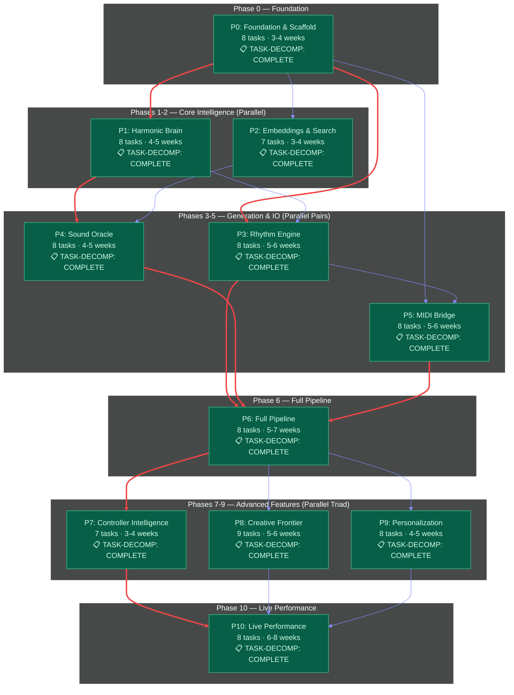
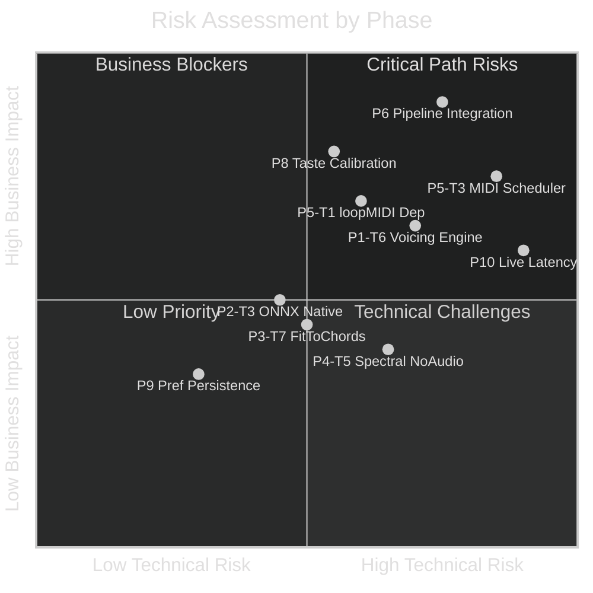
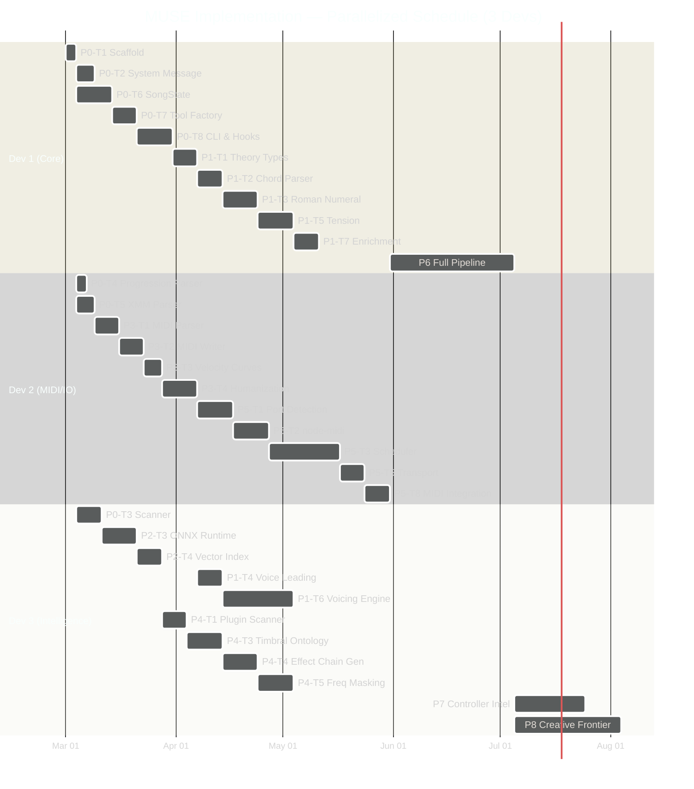

# MUSE — Orchestration State File

> **Purpose**: Single source of truth for implementation progress, subagent coordination, dependency tracking, and decision resolution.  
> **Last Updated**: 2026-02-09T12:00:00Z  
> **Managed By**: Orchestrator (primary session)  
> **Protocol**: Update this file after every subagent round, decision point, or status change.

---

## Master Dependency & Status Diagram



### Legend

| Symbol | Meaning |
|--------|---------|
| 🟢 `fill:#065f46` | Task decomposition COMPLETE — detailed engineering spec exists |
| 🟡 `fill:#92400e` | Task decomposition PENDING — outline exists, needs detailed spec |
| 🔴 `fill:#7f1d1d` | BLOCKED — upstream dependency incomplete |
| ⬜ `fill:#1f2937` | NOT STARTED — no work begun |
| 🔵 `fill:#1e3a5f` | IN PROGRESS — active development |
| ✅ `fill:#022c22` | SHIPPED — code complete and tested |

### Critical Path (Red Edges)

```
P0 → P1 → P3 → P5 → P6 → P8 → P10
                              ↳ P7, P9 (parallel)
```

Estimated critical path: **30–38 weeks** solo, **15–20 weeks** with 3 devs.

---

## Document Inventory & Status

### Task Decomposition Files (Engineering Specs)

| File | Phases | Status | Detail Level | Notes |
|------|--------|--------|--------------|-------|
| `tasks/00-OVERVIEW-AND-CROSS-PHASE-CONTRACTS.md` | All | ✅ Complete | Contracts C1–C9, SDK mapping, agent architecture, effort estimates | Master contracts — **IMMUTABLE** after Phase 0 ships |
| `tasks/TASK-DECOMPOSITION-P0-P2.md` | 0, 1, 2 | ✅ Complete | Per-task: complexity, deps, interfaces, testing, risk | 23 tasks fully specified. C1-C8 contracts defined inline. |
| `tasks/TASK-DECOMPOSITION-P3-P5.md` | 3, 4, 5 | ✅ Complete | Per-task: complexity, deps, interfaces, testing, risk | 24 tasks fully specified. Contracts C9-C12 added. |
| `tasks/TASK-DECOMPOSITION-P6.md` | 6 | ✅ Complete | Per-task: complexity, deps, interfaces, testing, risk | 8 tasks fully specified. Contract C13 defined. D-011 resolved. |
| `tasks/PHASE-07-CONTROLLER-INTELLIGENCE-SPEC.md` | 7 | ✅ Complete | Full engineering spec: XMM corpus analysis, D-012 resolved, all 7 tasks with TypeScript interfaces, risk matrix, appendices | ~700 lines. Highest detail level of any phase spec. |
| `tasks/PHASE-08-CREATIVE-FRONTIER.md` | 8 | ✅ Complete | Per-task: TypeScript interfaces, implementation hints, testing, risk | 9 tasks: creativity dials, multi-critic, quality gates, happy accidents, genre bending, surprise mode, explanation, variations, metrics |
| `tasks/PHASE-09-PERSONALIZATION.md` | 9 | ✅ Complete | Per-task: TypeScript interfaces, implementation hints, testing, risk | 8 tasks: implicit tracker, preference model, epsilon-greedy, producer modes, defaults, introspection, persistence, speculative gen |
| `tasks/PHASE-10-LIVE-PERFORMANCE.md` | 10 | ✅ Complete | Per-task: TypeScript interfaces, implementation hints, testing, risk | 8 tasks: MIDI analyzer, harmonizer, complement gen, session manager, energy mapper, phrase detection, controller integration, recording |

### Phase Summary Files (High-Level Overviews)

| File | Status | Notes |
|------|--------|-------|
| `tasks/PHASE-00-FOUNDATION.md` | ✅ Complete | Task list + architecture decisions |
| `tasks/PHASE-01-HARMONIC-BRAIN.md` | ✅ Complete | Task list + theory foundations |
| `tasks/PHASE-02-EMBEDDINGS-SEARCH.md` | ✅ Complete | Task list + ONNX strategy |
| `tasks/PHASE-03-RHYTHM-ENGINE.md` | ✅ Complete | Task list + humanization spec |
| `tasks/PHASE-04-SOUND-ORACLE.md` | ✅ Complete | Task list + timbral ontology |
| `tasks/PHASE-05-VIRTUAL-MIDI.md` | ✅ Complete | Task list + loopMIDI strategy |
| `tasks/PHASE-06-FULL-PIPELINE.md` | ✅ Complete | High-level overview — **DETAILED DECOMPOSITION in TASK-DECOMPOSITION-P6.md** |
| `tasks/PHASE-07-CONTROLLER-INTELLIGENCE.md` | ✅ Complete | High-level — **DEEP SPEC in PHASE-07-CONTROLLER-INTELLIGENCE-SPEC.md** |
| `tasks/PHASE-08-CREATIVE-FRONTIER.md` | ✅ Complete | Full engineering spec with TypeScript interfaces |
| `tasks/PHASE-09-PERSONALIZATION.md` | ✅ Complete | Full engineering spec with TypeScript interfaces |
| `tasks/PHASE-10-LIVE-PERFORMANCE.md` | ✅ Complete | Full engineering spec with TypeScript interfaces |

### Detailed Phase Write-Ups

| File | Status | Notes |
|------|--------|-------|
| `phases/PHASE-00-FOUNDATION.md` | ✅ Complete | 971 lines, full architecture + tasks |
| `phases/PHASE-01-HARMONIC-BRAIN.md` | ✅ Complete | Full harmonic theory treatment |
| `phases/PHASE-02 through PHASE-10` | 🟡 Pending | Detailed write-ups exist in `tasks/` directory; need reformatting to `phases/` format |

### Supporting Documents

| File | Status | Notes |
|------|--------|-------|
| `docs/AI_MUSIC_PLATFORM_BLUEPRINT.md` | ✅ Complete | 921 lines. Master vision document. |
| `tasks/ROUND-2-DEEP-ANALYSIS.md` | ✅ Complete | 1050 lines. Cross-cutting architecture. |
| `docs/ORCHESTRATION_STATE.md` | ✅ This file | Orchestration hub |

---

## Phase-Level Status Tracker

### Phase 0 — Foundation & Scaffold

| Task | Name | Complexity | Status | Blocker | Notes |
|------|------|-----------|--------|---------|-------|
| P0-T1 | Project Scaffold & SDK Bootstrap | S | ⬜ Not Started | None | Root task |
| P0-T2 | System Message Template Engine | M | ⬜ Not Started | P0-T1 | |
| P0-T3 | Workspace Asset Scanner | M | ⬜ Not Started | P0-T1 | |
| P0-T4 | .progression JSON Parser | S | ⬜ Not Started | P0-T1 | |
| P0-T5 | .xmm XML Controller Parser | M | ⬜ Not Started | P0-T1 | |
| P0-T6 | SongState Schema & Persistence | L | ⬜ Not Started | P0-T1 | |
| P0-T7 | Tool Registration Factory | M | ⬜ Not Started | P0-T1,T3,T4,T5 | |
| P0-T8 | Session Lifecycle & CLI | L | ⬜ Not Started | All P0 | |

### Phase 1 — Harmonic Brain

| Task | Name | Complexity | Status | Blocker | Notes |
|------|------|-----------|--------|---------|-------|
| P1-T1 | Music Theory Types & Scales | M | ⬜ Not Started | P0-T1 | |
| P1-T2 | Chord Symbol Parser | M | ⬜ Not Started | P1-T1 | |
| P1-T3 | Roman Numeral Analyzer | L | ⬜ Not Started | P1-T1,T2 | |
| P1-T4 | Voice Leading Engine | M | ⬜ Not Started | P1-T1 | |
| P1-T5 | Tension Function | L | ⬜ Not Started | P1-T1,T3 | |
| P1-T6 | Chord-to-MIDI Voicing Engine | XL | ⬜ Not Started | P1-T1,T2,T4 | Highest risk in Phase 1 |
| P1-T7 | Enriched Progression Assembly | M | ⬜ Not Started | P1-T1–T5 | |
| P1-T8 | Harmony Agent Config | S | ⬜ Not Started | P1-T1–T7 | |

### Phase 2 — Embeddings & Search

| Task | Name | Complexity | Status | Blocker | Notes |
|------|------|-----------|--------|---------|-------|
| P2-T1 | Asset Descriptions (Prog+Arp) | M | ⬜ Not Started | P0-T3,T4; P1-T7 | |
| P2-T2 | Asset Descriptions (Preset+FX) | L | ⬜ Not Started | P0-T3 | |
| P2-T3 | ONNX Runtime & Tokenizer | L | ⬜ Not Started | P0-T1 | Can start parallel with P1 |
| P2-T4 | Float32Array Vector Index | M | ⬜ Not Started | P2-T3 | |
| P2-T5 | Embedding Pipeline & Builder | M | ⬜ Not Started | P2-T1–T4 | |
| P2-T6 | Cross-Modal Search Engine | M | ⬜ Not Started | P2-T3–T5 | |
| P2-T7 | Search Tool Registration | S | ⬜ Not Started | P2-T5,T6; P0-T7 | |

### Phase 3 — Rhythm Engine

| Task | Name | Complexity | Status | Blocker | Notes |
|------|------|-----------|--------|---------|-------|
| P3-T1 | MIDI Binary Parser (SMF) | M | ⬜ Not Started | P0-T1 | |
| P3-T2 | MIDI Binary Writer (SMF) | M | ⬜ Not Started | P3-T1 | |
| P3-T3 | Velocity Curve Engine | M | ⬜ Not Started | P0-T1 | |
| P3-T4 | Humanization Engine | L | ⬜ Not Started | P3-T3 | |
| P3-T5 | Ghost Note Generator | S | ⬜ Not Started | P3-T1 | |
| P3-T6 | Groove Template System | S | ⬜ Not Started | P3-T4 | |
| P3-T7 | Arp Analyzer & Transformer | L | ⬜ Not Started | P3-T1; P1-T2 | |
| P3-T8 | Rhythm Agent Config | S | ⬜ Not Started | All P3 | |

### Phase 4 — Sound Oracle

| Task | Name | Complexity | Status | Blocker | Notes |
|------|------|-----------|--------|---------|-------|
| P4-T1 | Plugin Scanner & Catalog | M | ⬜ Not Started | P0-T3; P2-T2 | |
| P4-T2 | Timbral Description Generator | M | ⬜ Not Started | P4-T1 | |
| P4-T3 | Timbral Ontology & Genre Map | L | ⬜ Not Started | P4-T1; P1-T8 | |
| P4-T4 | Effect Chain Generator | L | ⬜ Not Started | P4-T3 | |
| P4-T5 | Frequency Masking Analyzer | L | ⬜ Not Started | P4-T3,T4 | |
| P4-T6 | Genre Mix Templates | S | ⬜ Not Started | P1-T8 | |
| P4-T7 | Effect Parameter Calculator | S | ⬜ Not Started | None | Independent |
| P4-T8 | Sound & Mix Agent Config | S | ⬜ Not Started | All P4 | |

### Phase 5 — MIDI Bridge

| Task | Name | Complexity | Status | Blocker | Notes |
|------|------|-----------|--------|---------|-------|
| P5-T1 | Virtual MIDI Detection | L | ⬜ Not Started | P0-T1 | |
| P5-T2 | node-midi Wrapper | L | ⬜ Not Started | P5-T1 | |
| P5-T3 | Message Scheduler & Clock | XL | ⬜ Not Started | P5-T2 | **HIGHEST RISK** — worker thread timing |
| P5-T4 | .xmm Generator | M | ⬜ Not Started | P0-T5; P5-T1 | |
| P5-T5 | Transport Control | M | ⬜ Not Started | P5-T2,T3 | |
| P5-T6 | CC Automation System | M | ⬜ Not Started | P5-T2,T3 | |
| P5-T7 | Health Monitor | S | ⬜ Not Started | P5-T1,T2 | |
| P5-T8 | MIDI Bridge Integration | M | ⬜ Not Started | All P5; P3-T2 | |

### Phase 6 — Full Pipeline

| Task | Name | Complexity | Status | Blocker | Notes |
|------|------|-----------|--------|---------|-------|
| P6-T1 | Intent Decomposition Engine | L | ⬜ Not Started | P0-T7; P1-T8 | |
| P6-T2 | Stage DAG Orchestrator | XL | ⬜ Not Started | P6-T1 | D-011 resolved → Custom DAG |
| P6-T3 | Harmony Stage | M | ⬜ Not Started | P1 complete | |
| P6-T4 | Rhythm Stage | M | ⬜ Not Started | P3 complete | |
| P6-T5 | Sound Stage | M | ⬜ Not Started | P4 complete | |
| P6-T6 | Hybrid Output Renderer | L | ⬜ Not Started | P5 complete | |
| P6-T7 | Iteration & Refinement Loop | L | ⬜ Not Started | P6-T2, P6-T3–T6 | |
| P6-T8 | Composer Agent Config | S | ⬜ Not Started | All P6 | |

### Phase 7 — Controller Intelligence

| Task | Name | Complexity | Status | Blocker | Notes |
|------|------|-----------|--------|---------|-------|
| P7-T1 | target_control Reverse Engineering | XL | ⬜ Not Started | P0-T5; P5-T1 | D-012 resolved → Option (a) phased |
| P7-T2 | Controller Profile Database | M | ⬜ Not Started | P0-T5 | |
| P7-T3 | Context-Sensitive Auto-Mapping | L | ⬜ Not Started | P7-T1a, P7-T2 | |
| P7-T4 | Cross-Controller Translation | M | ⬜ Not Started | P7-T2 | |
| P7-T5 | Dynamic Remap Suggestions | M | ⬜ Not Started | P7-T3 | |
| P7-T6 | Controller Agent Config | S | ⬜ Not Started | P7-T2 | |
| P7-T7 | Controller Visualization | S | ⬜ Not Started | P7-T2 | |

### Phase 8 — Creative Frontier

| Task | Name | Complexity | Status | Blocker | Notes |
|------|------|-----------|--------|---------|-------|
| P8-T1 | Creativity Dial System | M | ⬜ Not Started | P0-T6 | |
| P8-T2 | Multi-Critic Evaluation System | XL | ⬜ Not Started | P1-T5; P3-T4 | |
| P8-T3 | Quality Gate Hook | L | ⬜ Not Started | P8-T2; P0-T7 | |
| P8-T4 | Happy Accident Generator | L | ⬜ Not Started | P8-T1 | |
| P8-T5 | Genre Bending Engine | L | ⬜ Not Started | P1-T8 (genre DNA) | |
| P8-T6 | Surprise Mode ("Go Wild") | M | ⬜ Not Started | P8-T1, P8-T4 | |
| P8-T7 | Explanation & Education System | M | ⬜ Not Started | P1-T3 | |
| P8-T8 | Variation Generator | L | ⬜ Not Started | P1, P3 generators | |
| P8-T9 | Creativity Metrics Dashboard | S | ⬜ Not Started | P8-T2 | |

### Phase 9 — Personalization

| Task | Name | Complexity | Status | Blocker | Notes |
|------|------|-----------|--------|---------|-------|
| P9-T1 | Implicit Preference Tracker | L | ⬜ Not Started | P0 hooks | |
| P9-T2 | Preference Profile Model | L | ⬜ Not Started | P9-T1 | |
| P9-T3 | Epsilon-Greedy Exploration | M | ⬜ Not Started | P9-T2 | |
| P9-T4 | Producer Mode Profiles | M | ⬜ Not Started | P9-T2 | |
| P9-T5 | Preference-Driven Defaults | M | ⬜ Not Started | P9-T2; all gen tools | |
| P9-T6 | Preference Introspection Tools | M | ⬜ Not Started | P9-T2 | |
| P9-T7 | Session Persistence via Hooks | M | ⬜ Not Started | P9-T2; P0 hooks | |
| P9-T8 | Speculative Pre-Generation | L | ⬜ Not Started | P9-T2; P3/P4 gens | |

### Phase 10 — Live Performance

| Task | Name | Complexity | Status | Blocker | Notes |
|------|------|-----------|--------|---------|-------|
| P10-T1 | Real-Time MIDI Input Analyzer | XL | ⬜ Not Started | P5-T8 | |
| P10-T2 | Live Harmonizer | L | ⬜ Not Started | P10-T1; P1-T2 | |
| P10-T3 | Complementary Part Generator | XL | ⬜ Not Started | P10-T1; P3 | |
| P10-T4 | Live Session Manager | L | ⬜ Not Started | P10-T1–T3; P5 | |
| P10-T5 | Performance Energy Mapper | M | ⬜ Not Started | P10-T1 | |
| P10-T6 | Phrase Boundary Detection | M | ⬜ Not Started | P10-T1 | |
| P10-T7 | Live Performance Controller Integration | M | ⬜ Not Started | P7-T2; P10-T4 | |
| P10-T8 | Session Recording & Playback | L | ⬜ Not Started | P10-T4; P3-T2 | |

---

## Subagent Orchestration Framework

### Principles

1. **No Guessing**: When a subagent encounters ambiguity, it MUST flag it rather than assume.
2. **Grounded Decisions**: Every architectural choice must reference one of: (a) the Blueprint, (b) a Cross-Phase Contract, (c) the Copilot SDK surface, or (d) MPC Beats observed behavior.
3. **Fail Forward**: If a subagent cannot complete a section, it writes `[UNRESOLVED: <description>]` markers with context for human or orchestrator resolution.
4. **Contract Fidelity**: All TypeScript interfaces must import/extend the contracts defined in `00-OVERVIEW-AND-CROSS-PHASE-CONTRACTS.md`. No duplicate or conflicting type definitions.
5. **Effort Honesty**: Complexity ratings (S/M/L/XL) must follow the calibration from P0–P5: S = <3 days, M = 3–7 days, L = 1–2 weeks, XL = 2–4 weeks.

### Subagent Assignment Protocol

```
┌──────────────────────────────────────────────────────────────┐
│                    ORCHESTRATOR (this session)                │
│                                                              │
│  1. Read ORCHESTRATION_STATE.md for current status           │
│  2. Identify next work items (PENDING decompositions)        │
│  3. Prepare subagent prompts with:                           │
│     a. Relevant contracts (C1–C12)                           │
│     b. Upstream phase summaries                              │
│     c. Explicit output format requirements                   │
│     d. Unresolved decisions from Decision Registry           │
│  4. Launch subagents (parallel when independent)             │
│  5. Review outputs for:                                      │
│     a. Contract compliance                                   │
│     b. Dependency accuracy                                   │
│     c. [UNRESOLVED] markers                                  │
│     d. Consistency with existing decompositions              │
│  6. Update this state file                                   │
│  7. Resolve [UNRESOLVED] items or escalate to user           │
└──────────────────────────────────────────────────────────────┘
```

### Subagent Prompt Template

When dispatching a subagent for task decomposition, use this structure:

```
ROLE: You are a senior software architect specializing in music technology 
      and AI agent frameworks.

TASK: Produce a detailed engineering specification for Phase {N} of the 
      MUSE AI Music Platform, matching the quality and format of the 
      existing P0-P5 decompositions.

CONTEXT PROVIDED:
  - Blueprint excerpt (Section {relevant})
  - Upstream contracts consumed by this phase
  - Downstream contracts produced by this phase  
  - Cross-Phase Contract definitions (C1-C12)
  - SDK feature mapping table
  - Existing phase summary file content

FORMAT REQUIREMENTS:
  Per task: ID, Name, Complexity (S/M/L/XL), Description (3-5 sentences),
  Dependencies (task IDs), SDK Integration (specific features used),
  Input Interface (TypeScript with full JSDoc), Output Interface (TypeScript),
  Testing (5+ concrete test cases with expected values),
  Risk (specific to this task, with mitigation).

CONSTRAINTS:
  - All TypeScript interfaces MUST extend or reference contracts C1-C12
  - All tool registrations MUST use defineMuseTool() factory (from P0-T7)
  - All agent configs MUST follow the customAgents pattern
  - Mark any uncertainty with [UNRESOLVED: description]
  - Do NOT invent new contracts without justification
  - Cross-reference task IDs precisely (P{N}-T{M} format)
```

### Ambiguity Resolution Protocol

When a subagent encounters something it cannot resolve:

```
┌─────────────────────────────────────────────────┐
│              AMBIGUITY DETECTED                  │
│                                                  │
│  1. Is it answered in the Blueprint?             │
│     YES → Use that answer. Cite section.         │
│     NO  → Step 2                                 │
│                                                  │
│  2. Is it answered in Cross-Phase Contracts?     │
│     YES → Use that contract. Cite C{N}.          │
│     NO  → Step 3                                 │
│                                                  │
│  3. Is it answered in SDK documentation?         │
│     YES → Use SDK approach. Cite feature.        │
│     NO  → Step 4                                 │
│                                                  │
│  4. Is it a design choice with clear tradeoffs?  │
│     YES → Document both options with pros/cons.  │
│           Write [DECISION NEEDED: ...] marker.   │
│     NO  → Step 5                                 │
│                                                  │
│  5. Is it unknowable without experimentation?    │
│     YES → Write [SPIKE NEEDED: ...] marker.      │
│           Estimate spike effort. Proceed with     │
│           best-guess and note assumption.         │
│     NO  → Write [UNRESOLVED: ...] with full      │
│           context for human resolution.           │
└─────────────────────────────────────────────────┘
```

---

## Decision Registry

Track all architectural decisions, especially those resolved via subagent consensus or user input.

| ID | Decision | Options Considered | Resolution | Resolved By | Phase Impact | Date |
|----|----------|-------------------|------------|-------------|--------------|------|
| D-001 | SDK transport mode | VS Code Extension API vs CLI JSON-RPC | **CLI JSON-RPC** — Copilot SDK is CLI-based, not Extension API | Gemini + GPT consensus | All | 2026-02-08 |
| D-002 | Agent architecture | Single session 6 agents vs Multi-session vs Role-switching | **Single session, 6 agents** — shared context, `infer: true` routing | Round 2 analysis | All | 2026-02-08 |
| D-003 | Embedding model | OpenAI API vs Local ONNX (all-MiniLM-L6-v2) | **Local ONNX** — no API dependency, ~80MB, 384-dim, fast | Gemini + GPT consensus | P2 | 2026-02-08 |
| D-004 | MIDI port solution | Direct RtMidi vs loopMIDI + node-midi | **loopMIDI + node-midi** — virtual port visible to MPC Beats | GPT recommendation | P5 | 2026-02-08 |
| D-005 | Quality gate thresholds | Lenient (0.4 floor) vs Strict (0.5 floor, 0.7 avg) | **Strict** — Gemini's thresholds adopted | Cross-pollination | P8 | 2026-02-08 |
| D-006 | Creativity dials | Single dial vs Two dials (harmonic + rhythmic) | **Two dials** — independent risk axes | GPT + Gemini consensus | P8 | 2026-02-08 |
| D-007 | State serialization | JSON only vs JSON + MessagePack | **JSON + MessagePack** — JSON for debug, MessagePack for perf | GPT recommendation | P0 | 2026-02-08 |
| D-008 | Context compression | SDK-only vs SDK + MUSE L0–L3 | **Dual** — SDK handles conversation; MUSE handles SongState | Architectural analysis | P0 | 2026-02-08 |
| D-009 | Project name | MUSE vs Maestro vs Sonora | **MUSE** (Music Understanding and Synthesis Engine) | Blueprint consensus | All | 2026-02-08 |
| D-010 | Song state dependency | In conversation memory vs External serialization | **External** — SongState NEVER depends on conversation memory | GPT strong recommendation | P0 | 2026-02-08 |

### Pending Decisions

| ID | Question | Context | Options | Awaiting |
|----|----------|---------|---------|----------|
| D-011 | P6 orchestrator: DAG engine or sequential? | Composer agent coordinates multi-agent pipeline | (a) Custom DAG with `Promise.all` parallelism, (b) LangGraph-style graph, (c) Pure LLM orchestration | **RESOLVED → (a) Custom DAG** — augmented with LLM at stage boundaries. See TASK-DECOMPOSITION-P6.md |
| D-012 | Should Phase 7 reverse-engineer all Target_control indices? | ~116 target controls in .xmm files, many unknown | **Option (a): All indices, phased approach** — 7.1a (known ~40 targets, weeks 1-2), 7.1b (unknown ~67 targets via probing, weeks 3-4), 7.1c (extended 117-244 range, weeks 5-6). Unblocks T3 after 7.1a completes. | P7 SPEC (D-012 section) |
| D-013 | Phase 9 preference persistence: per-user or per-workspace? | User may use MUSE across multiple projects | **Option (a): Global `~/.muse/user-preferences.json`** — single user profile with producer-mode switching for project-specific overrides. Session history ring buffer (last 50). | P9 decomposition (Task 9.7) |
| D-014 | Phase 10 latency budget for live performance | Real-time MIDI response needed | **<5ms for harmonization, <50ms for complement generation** — harmonizer uses lookup-based interval calculation (trivial); complement gen uses pre-generation buffer (1-2 bars ahead). GC pauses mitigated via pre-allocated buffers + native addon for hot path. | P10 decomposition (Task 10.1-10.2) |

---

## Contract Registry

Cross-reference of all contracts, their defining location, and consuming phases.

| Contract | Name | Defined In | Producing Phase | Consuming Phases |
|----------|------|-----------|-----------------|-----------------|
| C1 | SongState | TASK-DECOMP-P0-P2 | P0 | ALL |
| C2 | EnrichedProgression | TASK-DECOMP-P0-P2 | P1 | P2, P3, P6, P8 |
| C3 | MidiPattern | TASK-DECOMP-P0-P2 | P3 | P5, P6, P10 |
| C4 | (merged into C1) | — | — | — |
| C5 | (merged into C8) | — | — | — |
| C6 | (merged into C7) | — | — | — |
| C7 | EmbeddingIndex | TASK-DECOMP-P0-P2 | P2 | P4, P6, P8, P9 |
| C8 | GenreDNA | TASK-DECOMP-P0-P2 | P0/P1 | P1, P3, P4, P6, P8, P9 |
| C9 | SynthPresetCatalog | TASK-DECOMP-P3-P5 | P4 | P6, P9 |
| C10 | EffectChain | TASK-DECOMP-P3-P5 | P4 | P5, P6, P7 |
| C11 | ControllerMapping | TASK-DECOMP-P3-P5 | P5/P7 | P6, P7, P10 |
| C12 | QualityScore | TASK-DECOMP-P3-P5 | P8 | P6, P8, P9 |
| C13 | ComposerPipeline | TASK-DECOMP-P6.md | P6 | P8, P10 |
| C14 | UserPreferences | PHASE-09-PERSONALIZATION.md Task 9.2 | P9 | ALL (via system context injection). 7 core dimensions (0-1), genre affinities, tempo range, key preferences, exploration budget, session history ring buffer. Persistence: `~/.muse/user-preferences.json`. |
| C15 | LivePerformanceState (LiveAnalysis) | PHASE-10-LIVE-PERFORMANCE.md Task 10.1 | P10 | P10 only. Real-time: detected key/mode/tempo, note density, energy level+trend, chord buffer, phrase boundaries. Updated per-note (<10ms). |

---

## Risk Heat Map



---

## Parallelization Map



---

## Quality Gates Checklist

Before any phase is marked COMPLETE, verify:

- [ ] All tasks have passing unit tests
- [ ] All TypeScript interfaces match cross-phase contract definitions (no drift)
- [ ] All `defineMuseTool()` registrations have Zod schemas + descriptions
- [ ] Agent routing tested with ≥10 sample queries per agent
- [ ] SongState round-trip: create → mutate → persist → load → compare (zero delta)
- [ ] Token budgets: system message ≤700, skill files ≤2000, agent prompts ≤3000
- [ ] README.md updated with new capabilities
- [ ] Performance benchmarks meet targets (documented per-task)
- [ ] No `[UNRESOLVED]` markers remain in spec files
- [ ] Integration test: end-to-end workflow through all completed phases

---

## Feedback Log

Record orchestrator observations, subagent quality notes, and user feedback.

| Date | Source | Observation | Action Taken |
|------|--------|------------|--------------|
| 2026-02-08 | Orchestrator | Gemini subagent had network timeouts during P0-P5 decomposition | Pivoted to GPT for full coverage; split into smaller prompts |
| 2026-02-08 | Orchestrator | P0-P5 task decomposition docs are high quality (~2000+ lines for P0-P2, ~2500+ for P3-P5) | P6-P10 decomposition must match this quality bar |
| 2026-02-08 | Blueprint | "The hardest problem is taste calibration" (Gemini) | D-014 registered as pending decision for P8/P9 |
| 2026-02-08 | Blueprint | "This is an AI that understands music at conservatory level" (GPT) | Theory depth in P1 must reflect this aspiration |
| 2026-02-08 | User | "avert guessing — provide clear guidance when subagents are unsure" | Ambiguity Resolution Protocol added to this file |
| 2026-02-09 | Orchestrator | P6 task decomposition completed — 8 tasks, C13 contract, D-011 resolved. Quality matches P0-P5 bar (~2700 lines). | TASK-DECOMPOSITION-P6.md created. ORCHESTRATION_STATE.md updated. |
| 2026-02-09 | Orchestrator | P7 deep engineering spec completed — 7 tasks with full TypeScript interfaces, XMM corpus analysis (67 files), D-012 resolved (phased approach). Includes appendices with .xmm schema, Mapping_control enum, anomalous target analysis. ~700 lines. HIGHEST QUALITY spec in the project. | PHASE-07-CONTROLLER-INTELLIGENCE-SPEC.md created. |
| 2026-02-09 | Orchestrator | P8-P10 task decompositions completed — all have per-task TypeScript interfaces, implementation hints, testing, risk flags. P8: 9 tasks (creativity dials through metrics). P9: 8 tasks (preference model through speculative gen). P10: 8 tasks (MIDI analyzer through session recording). | Individual phase files created in tasks/. |
| 2026-02-09 | Orchestrator | **ALL 11 PHASES NOW HAVE DETAILED ENGINEERING SPECS.** D-012, D-013, D-014 all resolved. Contracts C14 (UserPreferences) and C15 (LivePerformanceState) now defined. Orchestration state diagram updated — all nodes green. Project is READY FOR IMPLEMENTATION. | ORCHESTRATION_STATE.md fully updated. |

---

## Next Actions Queue

| Priority | Action | Assigned To | ETA | Depends On |
|----------|--------|------------|-----|------------|
| ✅ DONE | Produced TASK-DECOMPOSITION-P6.md | Completed | 2026-02-09 | Phase 6 summary |
| ✅ DONE | Resolved D-011 → Custom DAG with LLM at boundaries | Completed | 2026-02-09 | — |
| ✅ DONE | Resolved D-012 → All indices, phased approach (7.1a/b/c) | Completed | 2026-02-09 | P7 SPEC |
| ✅ DONE | P7 deep engineering spec (PHASE-07-CONTROLLER-INTELLIGENCE-SPEC.md) | Completed | 2026-02-09 | — |
| ✅ DONE | P8 task decomposition (PHASE-08-CREATIVE-FRONTIER.md) | Completed | 2026-02-09 | — |
| ✅ DONE | P9 task decomposition (PHASE-09-PERSONALIZATION.md) | Completed | 2026-02-09 | — |
| ✅ DONE | P10 task decomposition (PHASE-10-LIVE-PERFORMANCE.md) | Completed | 2026-02-09 | — |
| ✅ DONE | Updated ORCHESTRATION_STATE.md — all phases now COMPLETE | Completed | 2026-02-09 | — |
| ✅ DONE | TASK-DECOMPOSITION-P7-P10.md consolidated (32 tasks, D-012/13/14, C14/C15) | Completed | 2026-02-09 | P7-P10 individual specs |
| 🟡 P1 | Complete phases/ directory (P2-P10 detailed write-ups) | Subagents | Next session | Content exists in tasks/; needs reformatting |
| 🟢 P2 | Begin P0-T1 implementation (project scaffold) | Dev 1 | Post-planning | All decomposition complete ✅ |
| 🟢 P2 | Set up CI pipeline (Vitest, ESLint, TypeScript strict) | Dev 1 | With P0-T1 | — |

---

## Session Continuity Protocol

When resuming work on MUSE (new chat session or new day):

1. **Read this file first** — it is the single source of truth
2. **Check the Mermaid diagram** — green nodes are done, yellow need work, red are blocked
3. **Check the Decision Registry** — any pending decisions?
4. **Check the Next Actions Queue** — what's the highest priority?
5. **Check the Feedback Log** — any observations from previous sessions?
6. **Update the diagram** after completing work — change node colors, update status tables
7. **Log decisions** — even small ones, to maintain institutional memory

---

*This file is the beating heart of MUSE development. Keep it alive.*
